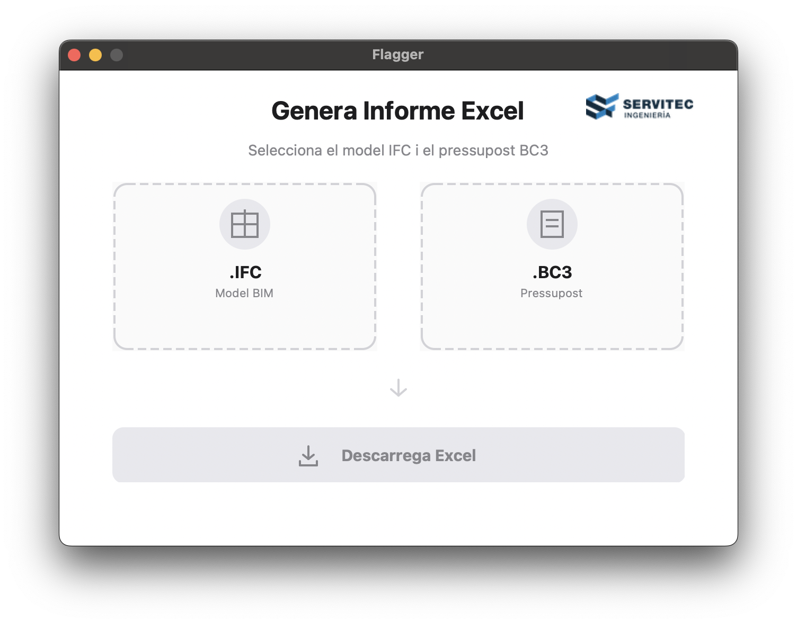

# Conflict Flagger AEC

**Automatically detect discrepancies between BIM models (IFC) and construction budgets (BC3).**

[](https://www.python.org/downloads/)
[](https://opensource.org/licenses/MIT)

<p align="center">
  
</p>

## Download

| Platform | Download | Size |
|----------|----------|------|
| **Windows** | [ConflictFlaggerAEC.exe](https://github.com/RaulAdSe/Conflict-flagger-AEC/releases) | ~67 MB |
| **macOS** | [Flagger.app](https://github.com/RaulAdSe/Conflict-flagger-AEC/releases) | ~413 MB |

## How It Works

1. **Drag & drop** your IFC model and BC3 budget files
2. **Click** "Generar Excel"
3. **Review** the color-coded Excel report

The app automatically detects:

| Issue | Description |
|-------|-------------|
| **Not Budgeted** | Elements in the 3D model missing from the budget |
| **Not Modeled** | Budget items without corresponding 3D elements |
| **Discrepancies** | Mismatched quantities (volumes, areas, lengths) |

## Output Report

Reports are saved to your **Downloads** folder with color-coded results:

| Color | Meaning |
|-------|---------|
| Green | Correct - No issues |
| Yellow | Warning - Review recommended |
| Red | Error - Requires attention |

### Report Sheets

| Sheet | Content |
|-------|---------|
| Resum | Summary statistics |
| Discrepàncies | All detected conflicts |
| Elements Emparellats | Successfully matched elements |
| Sense Pressupostar | Model elements without budget |
| Sense Modelar | Budget items without model |
| Resum Elements | Consolidated element summary |

---

## For Developers

### Installation

```bash
git clone https://github.com/RaulAdSe/Conflict-flagger-AEC.git
cd Conflict-flagger-AEC
pip install -r requirements.txt
```

### Run from Source

```bash
# Desktop app
PYTHONPATH=. python src/app_comparator.py

# Command line
python -m src.main --ifc model.ifc --bc3 budget.bc3 --output report.xlsx
```

### Build Executables

```bash
# macOS (.app bundle)
pyinstaller --clean --noconfirm conflict_flagger.spec

# Windows (via Wine on macOS, or native on Windows)
wine python -m PyInstaller --clean --noconfirm --distpath dist_win conflict_flagger.spec
```

### Architecture

```
IFC Model ──► IFC Parser ──┐
                           ├──► Matcher ──► Comparator ──► Reporter ──► Excel
BC3 Budget ──► BC3 Parser ─┘
```

### Project Structure

```
conflict-flagger-aec/
├── src/
│   ├── app_comparator.py      # Desktop application
│   ├── parsers/               # IFC & BC3 parsers
│   ├── matching/              # Element matching
│   ├── comparison/            # Discrepancy detection
│   └── reporting/             # Excel generation
├── docs/                      # Documentation
├── tests/                     # Unit tests
└── conflict_flagger.spec      # PyInstaller config
```

### Documentation

| Document | Description |
|----------|-------------|
| [Desktop App](docs/desktop-app.md) | Build & usage guide |
| [Guia d'Usuari](docs/guia-usuari.md) | User guide (Catalan) |
| [Architecture](docs/arquitectura.md) | System overview |
| [CLI](docs/cli.md) | Command line usage |

### Testing

```bash
python -m pytest
python -m pytest --cov=src
```

---

## License

MIT License - See [LICENSE](LICENSE) for details.

## Authors

Developed by [Servitec](https://servitec.com) for BIM project validation in the AEC sector.
