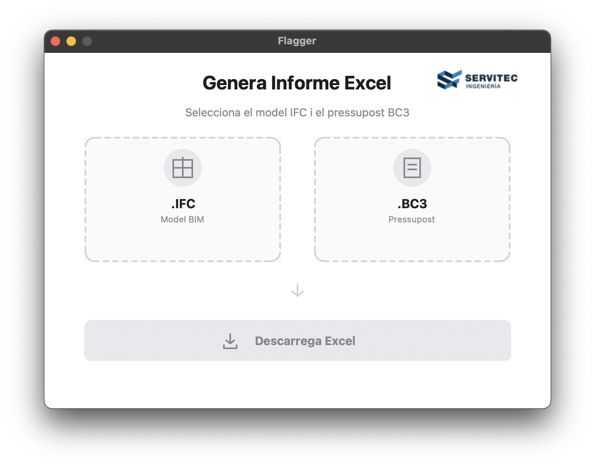

# Conflict Flagger AEC

<div align="center">

**Automatically detect discrepancies between BIM models (IFC) and construction budgets (BC3)**

[](https://www.python.org/downloads/)
[](https://opensource.org/licenses/MIT)
[]()



*A desktop application for AEC professionals to validate BIM models against construction budgets*

</div>

---

## The Problem

In construction projects, **BIM models** (IFC files) and **budgets** (BC3 files) are often created separately. This leads to:

- Elements modeled but not budgeted (cost overruns)
- Budget items without corresponding 3D elements (phantom costs)
- Quantity mismatches between model and budget (inaccurate estimates)

**Conflict Flagger** automatically detects these discrepancies, saving hours of manual cross-referencing.

---

## Features

| Feature | Description |
|---------|-------------|
| **Drag & Drop** | Simply drag your IFC and BC3 files into the app |
| **Smart Matching** | Intelligent element matching by code, name, and type |
| **Quantity Validation** | Detects mismatches in volumes, areas, lengths, and counts |
| **Excel Reports** | Color-coded reports with multiple analysis sheets |
| **Cross-Platform** | Native apps for Windows and macOS |
| **Tolerances** | Configurable tolerances for different unit types |

---

## Download

| Platform | Download | Size |
|----------|----------|------|
| **Windows** | [ConflictFlaggerAEC.exe](https://github.com/RaulAdSe/Conflict-flagger-AEC/releases) | ~155 MB |
| **macOS** | [Flagger.app](https://github.com/RaulAdSe/Conflict-flagger-AEC/releases) | ~221 MB |

> **Note:** On macOS, you may need to right-click and select "Open" the first time to bypass Gatekeeper.

---

## How It Works

```
┌─────────────────┐     ┌─────────────────┐
│   IFC Model     │     │   BC3 Budget    │
│  (3D Elements)  │     │  (Cost Items)   │
└────────┬────────┘     └────────┬────────┘
         │                       │
         ▼                       ▼
   ┌───────────┐           ┌───────────┐
   │ IFC Parser│           │BC3 Parser │
   └─────┬─────┘           └─────┬─────┘
         │                       │
         └───────────┬───────────┘
                     ▼
              ┌─────────────┐
              │   Matcher   │
              │ (by code,   │
              │  name, type)│
              └──────┬──────┘
                     ▼
              ┌─────────────┐
              │ Comparator  │
              │ (quantities,│
              │  properties)│
              └──────┬──────┘
                     ▼
              ┌─────────────┐
              │  Reporter   │
              │   (Excel)   │
              └─────────────┘
```

### Detection Types

| Issue Type | Description | Example |
|------------|-------------|---------|
| **Not Budgeted** | Elements in the 3D model missing from the budget | A wall exists in IFC but has no budget line |
| **Not Modeled** | Budget items without corresponding 3D elements | Budget includes flooring not yet modeled |
| **Quantity Mismatch** | Different quantities between model and budget | IFC shows 100m² but budget says 95m² |

### Tolerance Thresholds

| Unit Type | Tolerance | Example |
|-----------|-----------|---------|
| Count (u, ud) | 0% (exact) | Doors, windows |
| Area (m², m2) | 5% | Floors, walls |
| Volume (m³, m3) | 5% | Concrete, fill |
| Length (m, ml) | 2% | Beams, pipes |

---

## Output Report

Reports are saved to your **Downloads** folder as Excel files with color-coded results:

### Color Coding

| Color | Meaning |
|-------|---------|
| 🟢 Green | Correct - No issues detected |
| 🟡 Yellow | Warning - Review recommended |
| 🔴 Red | Error - Requires attention |

### Report Sheets

| Sheet | Content |
|-------|---------|
| **Resum** | Summary statistics and overview |
| **Discrepàncies** | All detected conflicts with details |
| **Elements Emparellats** | Successfully matched elements |
| **Sense Pressupostar** | Model elements missing from budget |
| **Sense Modelar** | Budget items missing from model |
| **Resum Elements** | Consolidated element summary |

---

## Architecture

```
conflict-flagger-aec/
│
├── src/                          # Source code
│   ├── app_comparator.py         # 🖥️  Desktop GUI application (Tkinter)
│   ├── main.py                   # 💻 Command-line interface
│   │
│   ├── parsers/                  # 📄 File parsers
│   │   ├── ifc_parser.py         #    IFC file parser (ifcopenshell)
│   │   └── bc3_parser.py         #    BC3/FIEBDC-3 budget parser
│   │
│   ├── matching/                 # 🔗 Element matching
│   │   ├── matcher.py            #    Main matching orchestrator
│   │   ├── code_matcher.py       #    Match by element codes
│   │   ├── name_matcher.py       #    Match by element names
│   │   └── type_matcher.py       #    Match by element types
│   │
│   ├── comparison/               # ⚖️  Comparison logic
│   │   └── comparator.py         #    Quantity & property comparison
│   │
│   ├── reporting/                # 📊 Report generation
│   │   └── excel_reporter.py     #    Excel report with formatting
│   │
│   └── phases/                   # ⚙️  Analysis configuration
│       └── config.py             #    Phase definitions & tolerances
│
├── tests/                        # 🧪 Test suite
│   ├── test_controlled_scenarios.py
│   └── test_regression_scenarios.py
│
├── scripts/build/                # 🔨 Build scripts
│   ├── conflict_flagger.spec     #    PyInstaller configuration
│   ├── build_windows.bat         #    Windows build script
│   └── setup_dev.sh              #    Development setup
│
├── docs/                         # 📚 Documentation
│   └── design/                   #    Design assets & screenshots
│
└── data/                         # 📁 Test data
    └── baseline/                 #    Baseline IFC & BC3 files
```

### Key Components

#### Parsers (`src/parsers/`)

- **IFC Parser**: Uses `ifcopenshell` to extract building elements, quantities, and properties from Industry Foundation Classes files
- **BC3 Parser**: Parses FIEBDC-3 format budget files (Spanish standard for construction budgets)

#### Matching (`src/matching/`)

The matching system uses a multi-strategy approach:

1. **Code Matching**: Primary strategy - matches elements by their unique codes
2. **Name Matching**: Fuzzy matching for elements with similar descriptions
3. **Type Matching**: Falls back to matching by element type (wall, floor, etc.)

#### Comparison (`src/comparison/`)

The comparator validates matched elements:

- Checks quantity differences against unit-specific tolerances
- Detects missing elements in either direction
- Generates detailed conflict reports with severity levels

#### Reporting (`src/reporting/`)

Generates professional Excel reports with:

- Auto-sized columns and formatted headers
- Color-coded cells based on conflict severity
- Multiple sheets for different analysis views
- Summary statistics and charts

---

## For Developers

### Installation

```bash
git clone https://github.com/RaulAdSe/Conflict-flagger-AEC.git
cd Conflict-flagger-AEC
python -m venv venv
source venv/bin/activate  # On Windows: venv\Scripts\activate
pip install -r requirements.txt
```

### Run from Source

```bash
# Desktop application
PYTHONPATH=. python src/app_comparator.py

# Command-line interface
python -m src.main --ifc model.ifc --bc3 budget.bc3 --output report.xlsx
```

### Build Executables

See [BUILD.md](BUILD.md) for detailed build instructions.

```bash
# macOS
source venv/bin/activate
pyinstaller --clean --noconfirm scripts/build/conflict_flagger.spec

# Windows (native)
venv\Scripts\activate
pyinstaller --clean --noconfirm scripts/build/conflict_flagger.spec

# Windows (via Wine on macOS)
wine venv_win/Scripts/pyinstaller.exe --clean --noconfirm scripts/build/conflict_flagger.spec
```

### Testing

```bash
# Run all tests
python -m pytest

# Run with coverage
python -m pytest --cov=src

# Run specific test scenarios
python -m pytest tests/test_controlled_scenarios.py -v
python -m pytest tests/test_regression_scenarios.py -v
```

### Adding New Analysis Phases

Edit `src/phases/config.py` to add custom analysis configurations:

```python
Phase.CUSTOM: PhaseConfig(
    name="Custom Analysis",
    description="Your custom phase",
    check_codes=True,
    check_units=True,
    check_quantities=True,
    check_properties=False,
    quantity_tolerance=0.03,  # 3% tolerance
)
```

---

## Documentation

| Document | Description |
|----------|-------------|
| [BUILD.md](BUILD.md) | Build guide for executables |
| [docs/guia-usuari.md](docs/guia-usuari.md) | User guide (Catalan) |
| [docs/arquitectura.md](docs/arquitectura.md) | System architecture |
| [tests/README_controlled_tests.md](tests/README_controlled_tests.md) | Test scenarios |

---

## Technology Stack

| Component | Technology |
|-----------|------------|
| Language | Python 3.10+ |
| GUI Framework | Tkinter |
| IFC Parsing | ifcopenshell |
| Excel Generation | openpyxl |
| Packaging | PyInstaller |
| Testing | pytest |

---

## License

MIT License - See [LICENSE](LICENSE) for details.

---

## Authors

<div align="center">

Developed by **[Servitec Ingeniería](https://servitec.com)**

*For BIM project validation in the AEC (Architecture, Engineering, Construction) sector*

</div>
